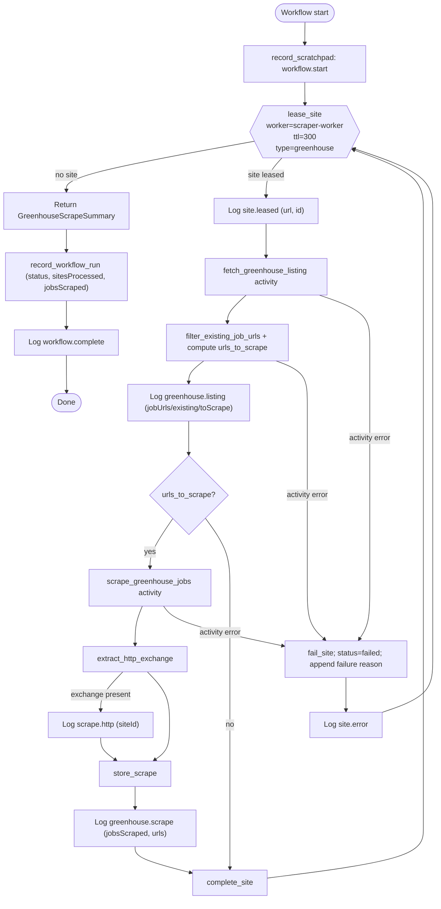

# GreenhouseScraperWorkflow

```mermaid
flowchart TD
    start([Workflow start]) --> logStart[record_scratchpad: workflow.start]
    logStart --> lease{{lease_site<br/>worker=scraper-worker<br/>ttl=300<br/>type=greenhouse}}
    lease -->|no site| summarize[Return GreenhouseScrapeSummary]
    lease -->|site leased| logLease["Log site.leased (url, id)"]
    logLease --> fetch[fetch_greenhouse_listing activity]
    fetch --> dedupe[filter_existing_job_urls + compute urls_to_scrape]
    dedupe --> logListing["Log greenhouse.listing (jobUrls/existing/toScrape)"]
    logListing --> hasUrls{urls_to_scrape?}
    hasUrls -->|yes| scrape[scrape_greenhouse_jobs activity]
    hasUrls -->|no| complete[complete_site]
    scrape --> httpCheck[extract_http_exchange]
    httpCheck -->|exchange present| logHttp["Log scrape.http (siteId)"]
    httpCheck --> store[store_scrape]
    logHttp --> store
    store --> logScrape["Log greenhouse.scrape (jobsScraped, urls)"]
    logScrape --> complete
    complete --> lease
    fetch -->|activity error| fail
    dedupe -->|activity error| fail
    scrape -->|activity error| fail
    fail[fail_site; status=failed; append failure reason] --> logError[Log site.error]
    logError --> lease
    summarize --> record["record_workflow_run (status, sitesProcessed, jobsScraped)"]
    record --> logDone[Log workflow.complete]
    logDone --> done([Done])
```
