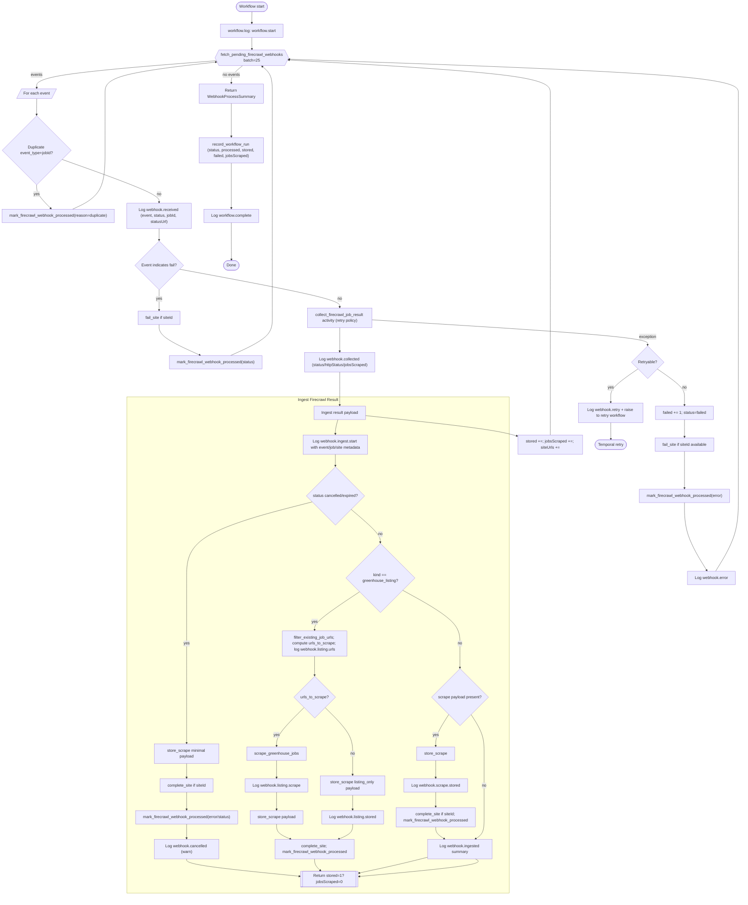

# ProcessWebhookScrape

```mermaid
flowchart TD
    start([Workflow start]) --> logStart[workflow.log: workflow.start]
    logStart --> fetchLoop{{fetch_pending_firecrawl_webhooks<br/>batch=25}}
    fetchLoop -->|no events| summarize[Return WebhookProcessSummary]
    fetchLoop -->|events| forEach[/For each event/]
    forEach --> dedup{Duplicate event_type+jobId?}
    dedup -->|yes| markDup["mark_firecrawl_webhook_processed(reason=duplicate)"] --> fetchLoop
    dedup -->|no| logReceived["Log webhook.received (event, status, jobId, statusUrl)"]
    logReceived --> failEvent{"Event indicates fail?"}
    failEvent -->|yes| failSite[fail_site if siteId] --> markFail["mark_firecrawl_webhook_processed(status)"] --> fetchLoop
    failEvent -->|no| collect["collect_firecrawl_job_result activity (retry policy)"]
    collect --> logCollected["Log webhook.collected (status/httpStatus/jobsScraped)"]
    logCollected --> ingest[Ingest result payload]
    ingest --> updateCounts[stored +=; jobsScraped +=; siteUrls +=] --> fetchLoop
    collect -->|exception| handleErr{Retryable?}
    handleErr -->|yes| logRetry[Log webhook.retry + raise to retry workflow] --> endRetry([Temporal retry])
    handleErr -->|no| failCount[failed += 1; status=failed]
    failCount --> maybeFailSite[fail_site if siteId available]
    maybeFailSite --> markErr["mark_firecrawl_webhook_processed(error)"]
    markErr --> logError[Log webhook.error] --> fetchLoop
    summarize --> record["record_workflow_run (status, processed, stored, failed, jobsScraped)"]
    record --> logDone[Log workflow.complete]
    logDone --> done([Done])

    subgraph Ingest Firecrawl Result
        ingestStart[Log webhook.ingest.start with event/job/site metadata]
        ingest --> ingestStart
        ingestStart --> expired{status cancelled/expired?}
        expired -->|yes| storeExpired[store_scrape minimal payload] --> completeExpired[complete_site if siteId]
        completeExpired --> markExpired["mark_firecrawl_webhook_processed(error/status)"] --> logCancelled["Log webhook.cancelled (warn)"] --> ingestReturn[[Return stored=1? jobsScraped=0]]
    expired -->|no| listing{kind == greenhouse_listing?}
        listing -->|yes| dedupeUrls[filter_existing_job_urls; compute urls_to_scrape; log webhook.listing.urls]
        dedupeUrls --> hasUrls{urls_to_scrape?}
        hasUrls -->|yes| scrapeGH[scrape_greenhouse_jobs] --> logListingScrape[Log webhook.listing.scrape] --> storeListing[store_scrape payload] --> completeListing[complete_site; mark_firecrawl_webhook_processed] --> ingestReturn
        hasUrls -->|no| storeListingOnly[store_scrape listing_only payload] --> logListingStored[Log webhook.listing.stored] --> completeListing
        listing -->|no| scrapePayload{scrape payload present?}
        scrapePayload -->|yes| storeScrape[store_scrape] --> logStored[Log webhook.scrape.stored] --> completeScrape[complete_site if siteId; mark_firecrawl_webhook_processed] --> logIngested[Log webhook.ingested summary] --> ingestReturn
        scrapePayload -->|no| logIngested --> ingestReturn
    end
```
