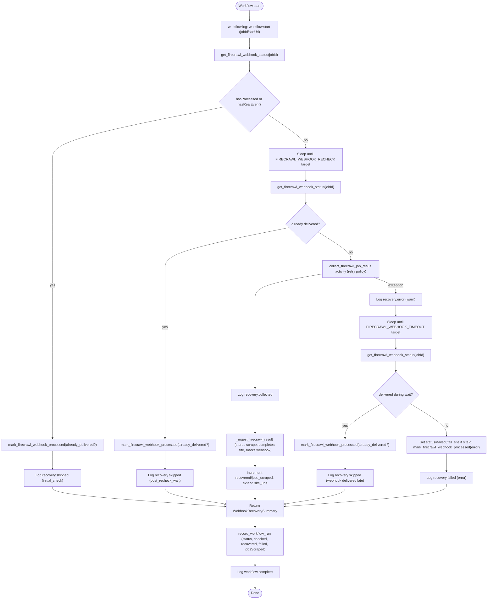

# RecoverMissingFirecrawlWebhook

```mermaid
flowchart TD
    start([Workflow start]) --> logStart["workflow.log: workflow.start (jobId/siteUrl)"]
    logStart --> stateCheck["get_firecrawl_webhook_status(jobId)"]
    stateCheck --> delivered{hasProcessed or hasRealEvent?}
    delivered -->|yes| markDelivered["mark_firecrawl_webhook_processed(already_delivered?)"] --> logSkipInitial["Log recovery.skipped (initial_check)"] --> summarize[Return WebhookRecoverySummary]
    delivered -->|no| waitRecheck[Sleep until FIRECRAWL_WEBHOOK_RECHECK target]
    waitRecheck --> stateCheck2["get_firecrawl_webhook_status(jobId)"]
    stateCheck2 --> delivered2{already delivered?}
    delivered2 -->|yes| markDelivered2["mark_firecrawl_webhook_processed(already_delivered?)"] --> logSkipRecheck["Log recovery.skipped (post_recheck_wait)"] --> summarize
    delivered2 -->|no| collect["collect_firecrawl_job_result activity (retry policy)"]
    collect --> logCollected[Log recovery.collected]
    logCollected --> ingest["_ingest_firecrawl_result (stores scrape, completes site, marks webhook)"]
    ingest --> recovered[Increment recovered/jobs_scraped, extend site_urls] --> summarize
    collect -->|exception| logAttemptError["Log recovery.error (warn)"]
    logAttemptError --> waitTimeout[Sleep until FIRECRAWL_WEBHOOK_TIMEOUT target]
    waitTimeout --> stateCheckFinal["get_firecrawl_webhook_status(jobId)"]
    stateCheckFinal --> deliveredFinal{delivered during wait?}
    deliveredFinal -->|yes| markDeliveredFinal["mark_firecrawl_webhook_processed(already_delivered?)"] --> logSkipLate["Log recovery.skipped (webhook delivered late)"] --> summarize
    deliveredFinal -->|no| fail["Set status=failed; fail_site if siteId; mark_firecrawl_webhook_processed(error)"] --> logFailed["Log recovery.failed (error)"] --> summarize
    summarize --> record["record_workflow_run (status, checked, recovered, failed, jobsScraped)"]
    record --> logDone[Log workflow.complete]
    logDone --> done([Done])
```
