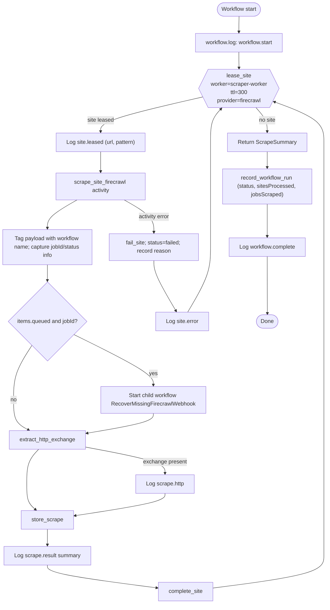

# ScraperFirecrawl

```mermaid
flowchart TD
    start([Workflow start]) --> logStart[workflow.log: workflow.start]
    logStart --> lease{{lease_site<br/>worker=scraper-worker<br/>ttl=300<br/>provider=firecrawl}}
    lease -->|no site| summarize[Return ScrapeSummary]
    lease -->|site leased| logLease["Log site.leased (url, pattern)"]
    logLease --> scrape[scrape_site_firecrawl activity]
    scrape --> tag[Tag payload with workflow name; capture jobId/status info]
    tag --> queued{items.queued and jobId?}
    queued -->|yes| child[Start child workflow RecoverMissingFirecrawlWebhook]
    queued -->|no| httpCheck[extract_http_exchange]
    child --> httpCheck
    httpCheck -->|exchange present| logHttp[Log scrape.http]
    httpCheck --> store[store_scrape]
    logHttp --> store
    store --> logResult[Log scrape.result summary]
    logResult --> complete[complete_site]
    complete --> lease
    scrape -->|activity error| fail[fail_site; status=failed; record reason]
    fail --> logError[Log site.error]
    logError --> lease
    summarize --> record["record_workflow_run (status, sitesProcessed, jobsScraped)"]
    record --> logDone[Log workflow.complete]
    logDone --> done([Done])
```
