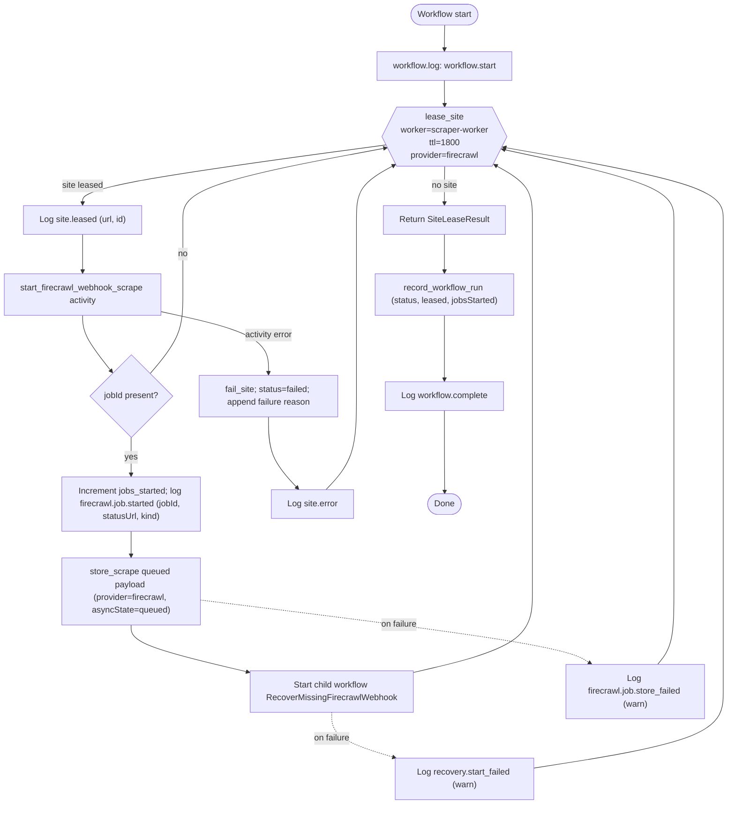

# SiteLease

```mermaid
flowchart TD
    start([Workflow start]) --> logStart[workflow.log: workflow.start]
    logStart --> lease{{lease_site<br/>worker=scraper-worker<br/>ttl=1800<br/>provider=firecrawl}}
    lease -->|no site| summarize[Return SiteLeaseResult]
    lease -->|site leased| logLease["Log site.leased (url, id)"]
    logLease --> startJob[start_firecrawl_webhook_scrape activity]
    startJob --> hasJob{jobId present?}
    hasJob -->|yes| recordJob["Increment jobs_started; log firecrawl.job.started (jobId, statusUrl, kind)"]
    hasJob -->|no| lease
    recordJob --> storeQueued["store_scrape queued payload (provider=firecrawl, asyncState=queued)"]
    storeQueued --> startChild[Start child workflow RecoverMissingFirecrawlWebhook]
    startChild --> lease
    storeQueued -.on failure.-> logStoreWarn["Log firecrawl.job.store_failed (warn)"] --> lease
    startChild -.on failure.-> logChildWarn["Log recovery.start_failed (warn)"] --> lease
    startJob -->|activity error| fail[fail_site; status=failed; append failure reason]
    fail --> logError[Log site.error]
    logError --> lease
    summarize --> record["record_workflow_run (status, leased, jobsStarted)"]
    record --> logDone[Log workflow.complete]
    logDone --> done([Done])
```
